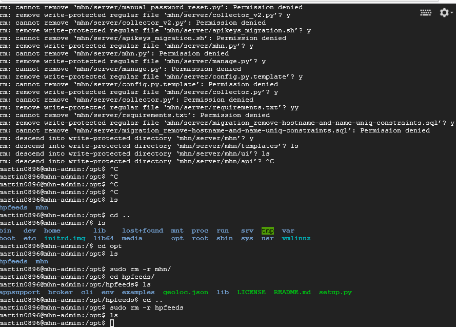

# Web Security CP week 9

# Week 9

Time spent: **20** hours spent in total

> Objective: Learn about Network Security by attacking and being attacked at vulnarable networked resources. Multiple Honey Pot VM instances were created to demonstrate it.
## Setting up process (w/errors)
- GIF walkthrough:
  
  >setting up and following the instructions of deploying mhn-admin on compute gc
  
  >Downloading the wrong thing initially because of wrong github supplied during instructions
  
  >More sshing in to mhn

### Errors during setup process
- GIF walkthrough:
    
    
### Fixing it afterwards by getting it from threatstream
- GIF walkthrough:

### long setup installation

## Which HoneyPot(s) you deployed
  - mhn-honeypot-1
  - mhn-honeypot-2
  - mhn-honeypot-3
  > 1 2 3
## Any issues you encountered
  > I had issues with setup due to instructions not being clear. See in gifs due process.

## A summary of the data collected: number of attacks, number of malware samples, etc.

1. GIF walkthroughs of demonstration on the attacks
    - Attack Stats:
      
    - Attacks Report:
      
2. Sensors deployed:
    

## Any unresolved questions raised by the data collected
  > N/A

## Resources

GIFs created with [screenToGifs](https://www.screentogif.com/).

## License

    Copyright [2018] [Martin Li]

    Licensed under the Apache License, Version 2.0 (the "License");
    you may not use this file except in compliance with the License.
    You may obtain a copy of the License at

        http://www.apache.org/licenses/LICENSE-2.0

    Unless required by applicable law or agreed to in writing, software
    distributed under the License is distributed on an "AS IS" BASIS,
    WITHOUT WARRANTIES OR CONDITIONS OF ANY KIND, either express or implied.
    See the License for the specific language governing permissions and
    limitations under the License.
